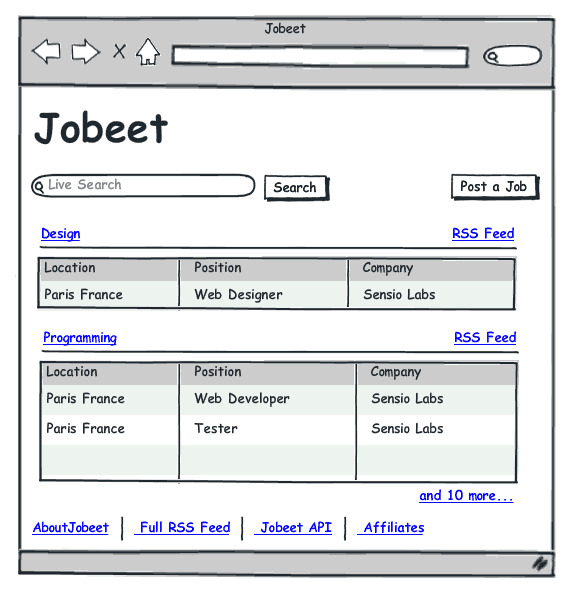
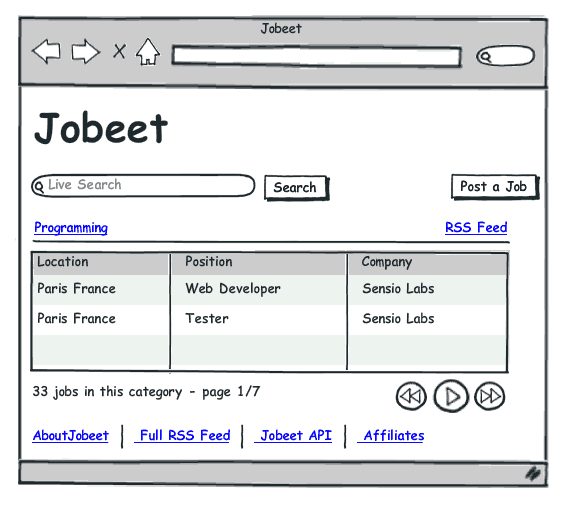
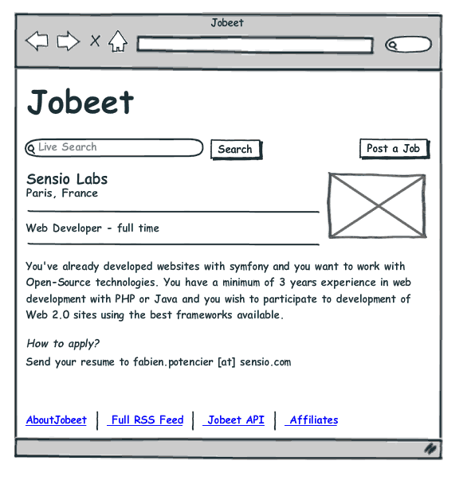
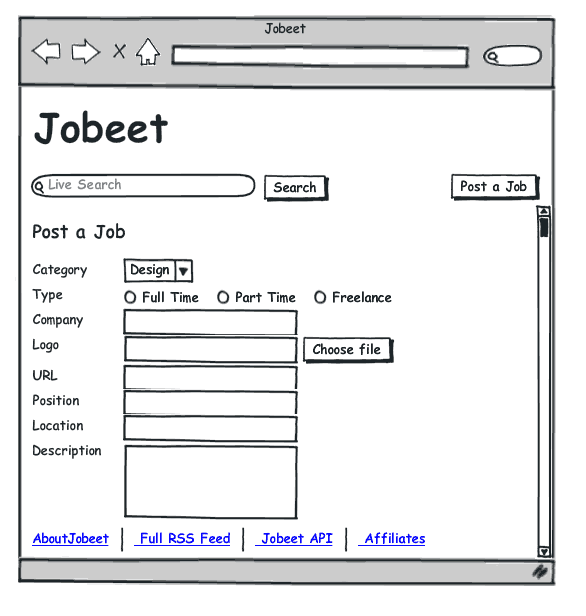

# Symfony2 Jobeet Day 2: 关于这个项目

今天是关于这个项目的规格说明。

具体设计和原来的Jobeet教程是一样的，你可以在[这里](http://www.symfony-project.org/jobeet/1_4/Doctrine/en/02)看到更多的详细设计及实体设计。

> ***Jobeet是一个开源的求职公告板网站**, 它只做一件事，但确尽量做得最好。它简单易用，能够定制、扩展力强，甚至能轻松的嵌入到你的网站中去。它不仅支持多语言的调用，而且也使用了时下最流行的Web2.0技术来提升用户体验。同时更提供了feeds和API使其能与其他程序进行交互。*

## 用户划分

我们的网站将有四种类型的用户：**管理员**（拥有并管理本网站），**普通用户**（访问本网站寻找职位），**发布者**（访问本网站并发布职位）和 **合作伙伴**（在他的网站中重新转发某份招聘信息）。

在原来的教程中，我们不得不做两个应用程序，分别是负责与网站用户进行交互的前台页面，和管理网站的后台应用程序。
[但使用了Symfony2，我们就不再需要这样做了。](http://symfony.com/doc/2.3/cookbook/symfony1.html)我们只有一个应用程序，并且我们可以为它单独设置安全权限。

## Story F1：在首页上用户可以看到最新的热门职位

在Jobeet主页上用户可以看到的按分类分组的10条最新的职位列表。每个职位只展示地点、职位和公司信息。每个分类下都有一个链接并列出其下的所有职位信息。用户既可以找工作也可以发布一份新的职位招聘信息。

## Story F2:用户可以在给定的分类下找到所有职位信息
用户可以看到按分类和日期排序并且分页的所有工作的列表，每页有20个职位。

## Story F3：用户使用关键字来细化列表
用户可以输入一些关键字来完善这一搜索。关键字可以是地点，职位，分类或公司名称。

## Story F4：用户点击职位来查看更多详细信息
用户可以从列表中选择一个职位，查看更详细的信息。

## Story F5：用户发布新的招聘信息

用户可以发布招聘信息。它由以下几部分组成：

* 公司名称
* 类型（全职，兼职，或自由职业者）
* Logo（可选）
* 网址（可选）
* 职位
* 地点
* 分类（在可能的分类列表中由用户选择）
* 职位描述（网址和电子邮件自动链接）
* 如何申请职位（网址和电子邮件自动链接）
* 是否共享（这份信息是否也可以在合作伙伴网站发布）
* 电子邮件（发布者的电子邮件）

这个过程只有两个步骤：首先，用户填写表单和所有必要的信息来描述这份工作，然后在最终发布页面中预览并验证这些信息。

无须创建一个帐户便可发布职位。而招聘信息的修改可以通过特定的URL来进行（通过用户创建信息时生成的令牌来保护）。

每个工作职位在线上有效期是30天（可由管理员配置）。用户可在到期之后的5天内回来重新激活或延长信息的有效期到30天。

## Story F6：用户申请成为合作伙伴

用户需要使用Jobeet的API必须申请成为合作伙伴，并获得授权。要申请成为合作伙伴，用户必须提供以下信息：

* 名称
* 电子邮件
* 网址

该合作伙伴帐户必须由管理员激活。一旦被激活，该合作伙伴可以通过电子邮件收到API地址和他的Token。

## Story F7：合作伙伴检索当前有效职位列表

合作伙伴可以通过他的Token和API获取当前职位列表。该列表可以是XML，JSON或YAML格式返回。合作伙伴可以限制职位要返回的数目并通过指定分类细化他的查询。

## Story B1：一个管理员配置网站

管理员可以编辑网站上的分类。

## Story B2：管理员管理工作

管理员可以编辑和删除任何发布的职位。

## Story B3：管理员管理合作伙伴

管理员可以创建或编辑合作伙伴。他负责激活或禁用他们。当管理员激活一个新的合作伙伴，系统会创建一个唯一的token给他们。

作为一名开发人员，你永远不应该在第一天就开始编写你的代码你首先需要做的是收集并整理项目的要求，然后切实的理解了它要做什么，最后才开始动手。这就是你今天所做的，不是吗？好了，明天见。